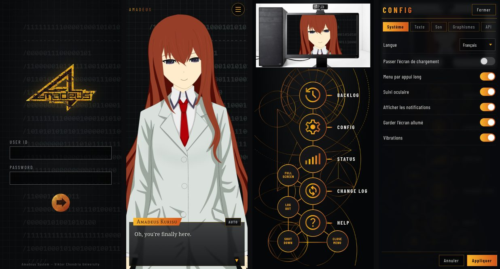

# Real Amadeus Mobile

Portage Android **non officiel** de [RealAmadeus](https://github.com/dsuv-sg/RealAmadeus) (DSUV / ELVELT) :
discutez avec **Amadeus Kurisu**, l'IA de *Steins;Gate 0*, animée en Live2D sur votre téléphone.



*English version, with the Ollama, Tailscale and VOICEVOX guides: [README.md](README.md).*

## Installer l'APK

1. Téléchargez `RealAmadeusMobile-<version>.apk` (onglet **Actions** → dernier build → artefact, ou page **Releases**).
2. Ouvrez le fichier sur le téléphone et autorisez l'installation depuis cette source si Android le demande.
3. Lancez **Amadeus**. Identifiants (comme dans l'anime) : `Salieri` / `MakiseKurisu`.
   Ils sont pré-remplis après la première connexion.
4. Menu (bouton ☰ ou appui long) → **CONFIG** → **API** : choisissez un fournisseur et collez votre clé API.

Android 7.0 ou plus récent. La clé et la mémoire de Kurisu restent sur l'appareil (sauvegarde Android désactivée).

## Ce qui a été porté

| RealAmadeus (Unity, PC) | Real Amadeus Mobile |
| --- | --- |
| Écran de connexion, séquence de démarrage, logo | Identiques (touchez l'écran pour passer le démarrage) |
| Kurisu Live2D (Cubism 5) | Même modèle, texture ramenée à 4096 / 2048 px pour les GPU mobiles |
| Émotions procédurales, clignements, respiration, sommeil après 60 s, éternuement caché | Portage ligne à ligne de `AmadeusChatController.LateUpdate()` |
| Suivi du regard à la souris | Kurisu suit votre doigt |
| Dialogue façon visual novel (pages, ▼, mode AUTO, Ctrl+C) | Toucher pour avancer, bouton AUTO, bouton ✕ pour annuler |
| OpenAI (+ API compatible), Gemini, Claude, Groq (+ recherche web Compound), Vertex AI, Ollama, OpenRouter | Tous, en streaming ; Vertex AI en mode Express (clé API, pas de gcloud sur téléphone) |
| Mémoire long terme (faits, épisodes, résumés), RAG BM25 | Identique, plus un écran pour consulter et effacer les souvenirs |
| Menu circulaire, BACKLOG, CONFIG, STATUS, CHANGE LOG, HELP | Identiques ; Kurisu s'affiche dans l'écran du PC du labo quand le menu est ouvert |
| TTS Windows (SAPI) et dictée Windows / Whisper | Synthèse vocale et reconnaissance vocale d'Android, ou voix japonaise VOICEVOX (voir plus bas) |
| Notifications de bureau | Notification Android quand une réponse arrive en arrière-plan |
| 11 langues | Les 11 langues d'origine ; les textes ajoutés existent en français, anglais et japonais (anglais ailleurs), les répliques d'erreur de Kurisu dans les 11 langues |

Principaux ajustements : réponses en streaming pour tous les fournisseurs, commandes de mémoire expliquées au modèle
dans toutes les langues (l'original ne les décrivait qu'en français, allemand et russe), option « Personnalité détaillée »
qui utilise le long prompt japonais de l'original (présent dans le code mais inutilisé), Claude via le SDK officiel
avec repli automatique côté serveur en cas de refus.

## Voix japonaise (VOICEVOX)

Kurisu peut parler japonais pendant que son texte reste en français, comme un anime sous-titré. La voix vient de
[VOICEVOX](https://voicevox.hiroshiba.jp/), logiciel gratuit de synthèse vocale qui tourne sur votre PC.

1. Installez VOICEVOX sur le PC, puis fermez l'application.
2. Lancez `scripts/windows/Lancer-VOICEVOX-pour-Amadeus.bat` : la première fois en administrateur (clic droit),
   pour autoriser le port 50021 dans le pare-feu, ensuite par un simple double-clic. Il démarre le moteur de
   VOICEVOX en acceptant les connexions du téléphone (l'application VOICEVOX, elle, n'écoute que le PC lui-même).
3. Dans l'app : CONFIG → Voix → Voix : VOICEVOX. Laissez l'adresse vide si VOICEVOX tourne sur le même PC
   qu'Ollama, sinon indiquez `http://<adresse-du-PC>:50021`. Choisissez une voix, testez avec « Écouter ».

Le modèle écrit chaque phrase en deux versions (`[VOICE: 日本語]` puis le texte affiché) ; la voix est synthétisée
pendant que la réponse arrive et la bouche de Kurisu suit le volume réel de la voix. Chaque voix VOICEVOX a ses
conditions d'utilisation, qui demandent de créditer « VOICEVOX:nom du personnage » : l'app l'affiche dans CONFIG et STATUS.

## Compiler

Prérequis : Node.js 22, JDK 17+, `git`, `curl`, `zip`. Pas besoin d'Android Studio ni de Gradle.

```bash
./scripts/build-apk.sh          # → android/build/RealAmadeusMobile-<version>.apk
```

Le script récupère :
- le **Live2D Cubism SDK for Web** : Framework `5-r.3` (dépôt officiel) et Cubism Core 5.0 (copie vérifiée par SHA-256) ;
  ces fichiers ne sont pas versionnés, comme dans le projet d'origine ;
- un `android.jar` (API 34) et `aapt2` depuis le SDK Android si `ANDROID_HOME` est défini, sinon depuis des miroirs publics
  (sommes de contrôle figées), plus `dx` et `apksig` depuis Maven Central.

Développement de l'interface dans un navigateur :

```bash
cd web && npm ci && npm run fetch:live2d && npm run dev
npm test          # tests de l'analyseur de réponses et de la recherche en mémoire
```

GitHub Actions (`.github/workflows/android.yml`) construit l'APK à chaque push sur `main` (et à la demande depuis
l'onglet Actions) ; un tag `v*` publie aussi une release.

### Clé de signature

Android n'installe une mise à jour par-dessus l'ancienne version que si les deux sont signées avec la même clé.
La clé n'est **pas** dans le dépôt. Le script cherche, dans l'ordre : les variables d'environnement
`ANDROID_KEYSTORE_BASE64`, `ANDROID_KEYSTORE_PASSWORD` et `ANDROID_KEY_ALIAS` (à définir comme **secrets** du dépôt
pour GitHub Actions) ; un fichier local `android/signing/amadeus-personal.p12` avec `android/signing/keystore.properties`
(ignorés par git) ; sinon une clé jetable (l'APK ne s'installera pas par-dessus une version signée autrement).
Voir la section *Signing* du [README anglais](README.md#signing) pour créer une clé.

Les builds publiés depuis ce dépôt sont signés avec le certificat d'empreinte SHA-256
`3B:8B:41:FC:55:5A:2F:F6:5A:16:FD:8D:2C:9E:DD:FB:1D:ED:A4:16:EE:D0:30:E3:E5:C0:24:DF:A1:39:47:1B`.

## Structure

```
web/        application (TypeScript + Vite) : rendu Live2D, animation, IA, mémoire, interface
android/    coque Android en Java (WebView, pont natif : HTTP sans CORS, voix, notifications)
scripts/    récupération des dépendances, conversion des assets, extraction des prompts, build de l'APK, lanceur VOICEVOX
```

## Crédits et licences

- **RealAmadeus** © DSUV / ELVELT, [CC BY-NC 4.0](https://creativecommons.org/licenses/by-nc/4.0/).
  Ce portage réutilise le modèle Live2D de Kurisu, les images, les textes de localisation, les prompts et la logique
  du projet d'origine, adaptés au mobile. Ce projet est lui aussi distribué sous **CC BY-NC 4.0** (voir `LICENSE`) :
  usage non commercial uniquement, crédit obligatoire. Il n'est ni affilié ni approuvé par DSUV / ELVELT.
- **Steins;Gate 0** © MAGES. / Nitroplus. Œuvre de fan non commerciale, conformément aux
  [lignes directrices de Nitroplus](https://www.nitroplus.co.jp/company/license/fan-fiction/).
- **Live2D Cubism SDK** © Live2D Inc. — Core : Live2D Proprietary Software License (fichiers redistribuables) ;
  Framework : Live2D Open Software License. Les APK incluent ces fichiers comme le permettent ces licences.
- Polices : Barlow Condensed, Mate SC, Noto Serif et Departure Mono (SIL Open Font License).
- **VOICEVOX** (optionnel, installé par l'utilisateur sur son PC) : chaque voix s'utilise selon ses propres conditions,
  avec le crédit « VOICEVOX:nom du personnage ».
